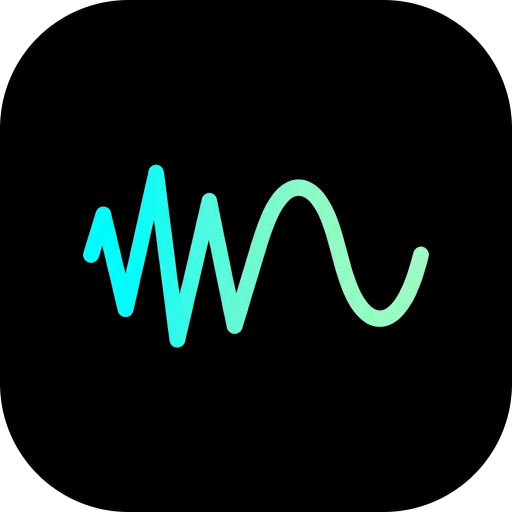

<p align="center">
  
</p>
<h1 align="center">DeepDenoiser</h1>
<p align="center">
  <a href="https://github.com/sayampy/deepdenoiser/releases">
    
  </a>
  
  <a href="LICENSE">
    
  </a>
  <a href="https://www.android.com/">
    
  </a>
</p>
<p align="center">
  Offline AI audio denoiser for audio and video. Private, on-device, and fast.
</p>

<h2 align="center">Download From:</h2>
<p align="middle">
  <a href="https://play.google.com/store/apps/details?id=com.sayampy.deepdenoiser">
    
  </a>
  <a href="https://github.com/sayampy/deepdenoiser/releases">
    
  </a>
</p>
<h2 align="center">Support This Project</h2>
<p align="middle">
  <a href="https://ko-fi.com/sayampy">
    
  </a>
  <a href="https://github.com/sponsors/sayampy"></a>
</p>

**DeepDenoiser** is a powerful, open-source mobile application designed to remove background noise from your audio and video files instantly.

Powered by the state-of-the-art **DeepFilterNet3** model, it runs entirely on your device—ensuring your data remains private and your processing is lightning fast.

---

<p align="center" float="left">
  
  
</p>


https://github.com/user-attachments/assets/29f147db-ff8b-486a-877d-1d765922ed5c


---

## ✨ Features

- **🔇 Advanced Noise Suppression**: Eliminates background hiss, hums, and environmental noise using deep learning.
- **🎥 Audio & Video Support**: Process both voice recordings and video clips seamlessly.
- **🎤 Live Suppression**: Capture voice recordings directly within the app with integrated, real-time noise removal.
- **🔒 Privacy First**: All processing happens locally on your device using ONNX Runtime. No data is ever uploaded to the cloud.
- **🚀 High Performance**: Built with custom Native Modules (Kotlin) for efficient media transcoding and I/O.
- **📱 Modern Design**: Clean, simple interface built with React Native & Expo.

## 🛠️ Tech Stack

- **Framework**: React Native (Expo SDK 55+)
- **AI Model**: DeepFilterNet3 (via `onnxruntime-react-native`)
- **Native Logic**: Custom Kotlin modules for Android `MediaCodec` handling
- **State Management**: React Hooks & Expo Router

## 🚀 Get Started

### Prerequisites

- Bun (Recommended)
- Android Development Environment (Android Studio)

### Installation

1. **Clone the repository**

   ```bash
   git clone https://github.com/sayampy/deepdenoiser.git
   cd deepdenoiser
   ```

2. **Install dependencies**

   ```bash
   bun install
   ```

3. **Run on Android**
   _(Note: This project uses custom native code, so you must use a Development Build, not Expo Go)_
   ```bash
   bunx expo run:android
   ```

## 📄 License

This project is licensed under the GPL-3.0 License - see the [LICENSE](LICENSE) file for details.
